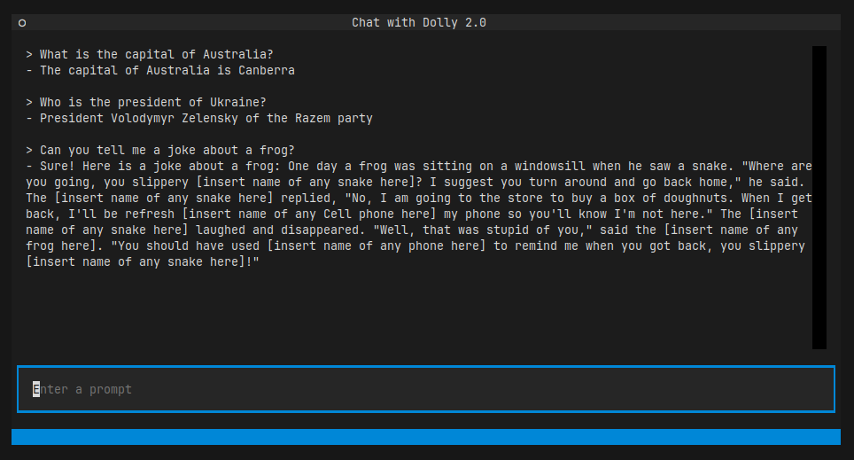

# Dolly 2.0 CLI

Dolly 2.0 is an LLM similar to ChatGPT but open-sourced and trainable. This is an unofficial CLI that allows you to easily download and interact with the model via the command line.

## Prerequisites

- Git
- Python 3.x

## Instructions

- Clone the repository
- Run the `./setup.sh` command
- When you are ready to talk to Dolly, run the `./run.sh` command